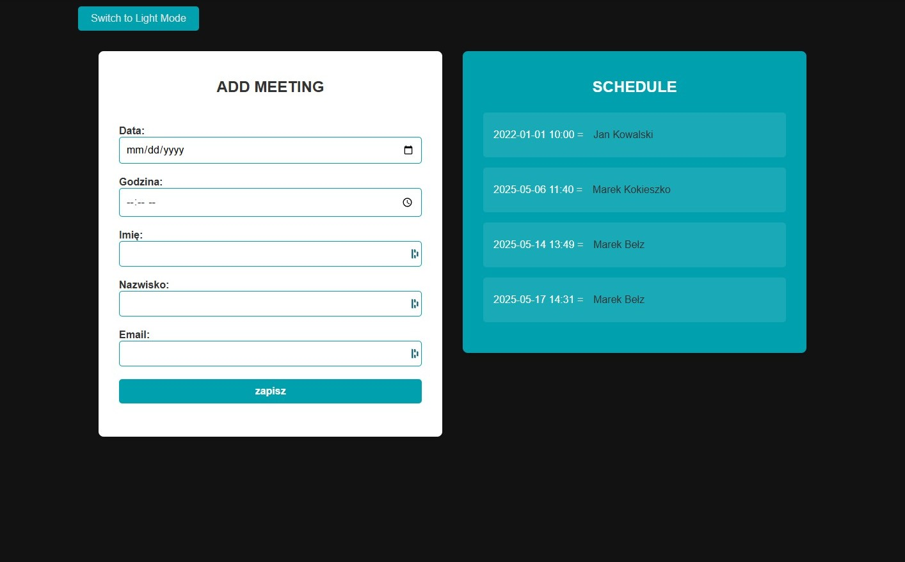

# React Redux Calendar

This repository is dedicated to practicing and mastering state management in React using Redux.

**Main features**:
- Manage application state with Redux.
- Integrate Redux DevTools for debugging.
- Fetch and persist data using a local JSON server.
- Implement a calendar application with meeting scheduling functionality.

&nbsp;

## 🔶 Technologies


&nbsp;

## 🔶 Installation

The project uses [Node.js](https://nodejs.org/en/) and [npm](https://www.npmjs.com/). To run the project locally, follow these steps:

1. Clone the repository:
   ```bash
   git clone https://github.com/marazmlab/task-react-redux-basics.git

2. Navigate to the project directory:
   ```bash
   cd task-react-redux-basics
   ```

3. Install dependencies:
   ```bash
   npm install
   ```

4. Start the JSON server for the API:
   ```bash
   json-server --watch ./db/data.json --port 3005
   ```

5. Start the development server:
   ```bash
   npm start
   ```

The application will be available at http://localhost:8080.

&nbsp;

## 🔶 Tasks Overview

The project contains several tasks organized in folders `01` to `05`, each demonstrating different styling methods. Below is an overview of the tasks:

- Meeting List: Displays a list of scheduled meetings fetched from the JSON server.
- Add Meeting: Allows users to schedule new meetings using a form.
- Theme Toggle: Switch between light and dark themes dynamically.
- Redux Integration: Centralized state management for meetings using Redux.


&nbsp;

## 🔶 Solutions provided in the project

### Example: Adding a Meeting

```jsx
<Card>
  <Card.Img src="image.jpg" alt="Example" />
  <Card.Body>
    <Card.Title>Card Title</Card.Title>
    <Card.Text>Some example text to build on the card title and make up the bulk of the card's content.</Card.Text>
    <Button variant="primary">Go somewhere</Button>
  </Card.Body>
</Card>
```
This example showcases:
- **Form validation**: Ensures all required fields are filled and email is valid.
- **API integration**: Sends the form data to the JSON server and updates the Redux store.


&nbsp;

## 🔶 Conclusions

- **State management**: Redux simplifies state handling and makes the application scalable.
- **Component structure**: The project demonstrates modular and reusable components.
- **Styling**: SCSS modules are used for consistent and maintainable styles. 
- **API integration**: The project fetches and persists data using a local JSON server.

This project provides a solid foundation for mastering React and Redux.

&nbsp;

## 🔶 Feel free to contact me

If you have any questions or feedback, feel free to reach out!  
Find me on [GitHub](https://github.com/marazmlab) or [LinkedIn](https://www.linkedin.com/in/belz/).

&nbsp;

## 🔶 Thanks / Special thanks / Credits

Thanks to my [Mentor - devmentor.pl](https://devmentor.pl/) – for providing me with this task and for code review.
